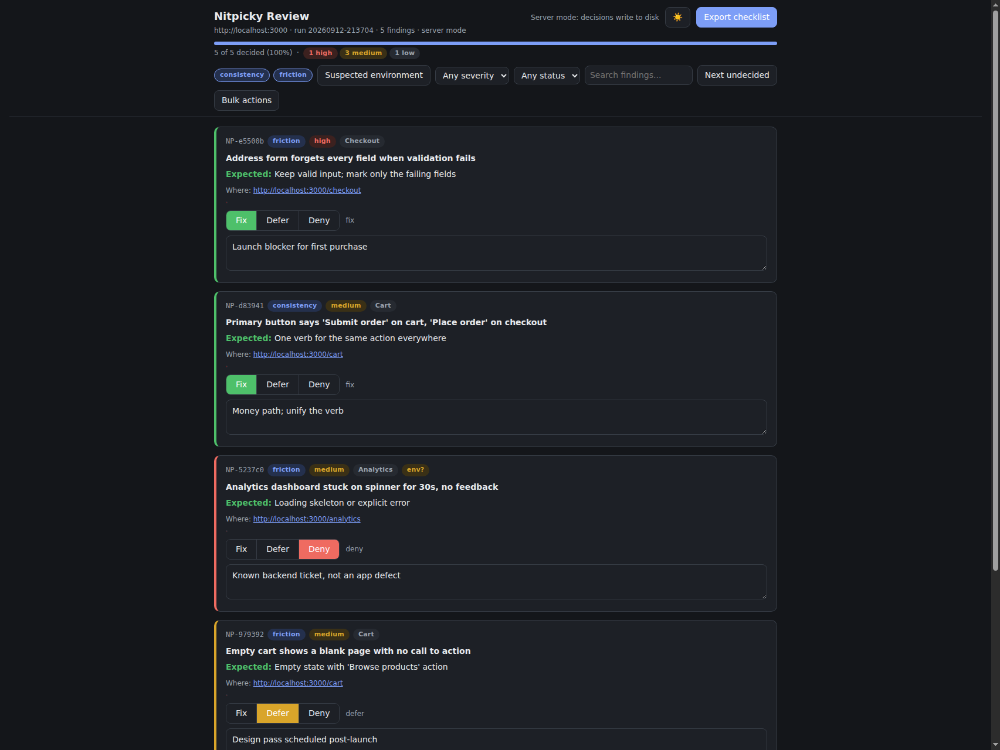

# nitpicky



Pre-launch polish sweep for your UI: parallel review agents walk your entire running
app, one concern each, and screenshot every page and state to surface the little
defects that get normalized during a build. You triage each one in a local decision
portal (fix / deny / defer, with your explanation, written to disk as you click), and
the export is a checklist your implementation team can execute.

Works with **any UI that can be screenshotted**. The triage portal works with
**any tool that can emit findings JSON** (axe-core and Lighthouse adapters included).

## What nitpicky is not

Nitpicky is not a UI design system, component library, or style guide, and it has
no opinions about how your app should look. Its whole purpose is to be nitpicky
about **what is already built**: the inconsistencies, friction, unclear copy,
misalignments, and accessibility gaps that slip past a build. Bring your own design
decisions; nitpicky finds where the implementation drifts from them.

## How it works

```
 walk ──> merge ──> triage ──> hand off
```

1. **Walk**: five lens agents (consistency, friction, clarity, visual
   polish, accessibility) each walk the whole app in their own isolated browser and
   attach screenshot proof to every finding. Contracts:
   [`lib/lenses.md`](lib/lenses.md), [`lib/findings-schema.md`](lib/findings-schema.md),
   [`schema/lens-findings.schema.json`](schema/lens-findings.schema.json).
2. **Merge**: validates findings, assigns content-hash ids (stable across
   re-merges), clusters cross-lens near-duplicates, flags byte-identical screenshots
   as contaminated evidence, aggregates route coverage, scrubs configured secrets,
   and prints a run-health summary.
3. **Triage**: a local portal serves the review page; every decision writes
   atomically to `decisions.json`. A browser draft queue survives server outages
   behind a Retry button. Bulk actions apply one decision to the filtered set;
   clustered duplicates take one click; suspected server-side noise is filterable.
4. **Hand off**: `CHECKLIST.md` groups Fix / Deferred / Denied with evidence,
   expected behavior, and your verbatim context.

## Install

```bash
pipx install git+https://github.com/masharratt/nitpicky-ui.git
```

or clone and symlink if you use the skill inside Claude Code:

```bash
git clone https://github.com/masharratt/nitpicky-ui.git ~/projects/nitpicky
ln -s ~/projects/nitpicky ~/.claude/skills/nitpicky
```

Requires Python 3.9+ (stdlib only at runtime). For agent-driven walkthroughs you
also need a Playwright-capable browser. The portal is loopback-only by design:
single reviewer, local files.

## Quick start (no agent needed)

Try the full flow on the bundled demo run:

```bash
nitpicky review examples/demo-run
# opens http://127.0.0.1:<port>/review.html: decide, then Export
```

A full walkthrough run:

```bash
nitpicky init . http://localhost:3000 --routes-file routes.txt --redact-file secrets.txt
# ... walkthrough agents (or any reviewer) write findings/<source>.json ...
nitpicky merge  --run-dir planning/nitpicky/<run-id>
nitpicky review --run-dir planning/nitpicky/<run-id>   # triage; decisions autosave
nitpicky export --run-dir planning/nitpicky/<run-id>   # writes CHECKLIST.md
```

## Run it more than once

One pass is a snapshot, not a verdict. Run nitpicky repeatedly, especially:

- after each fix batch, to confirm the fixes and catch what they touched
- at different app states: empty data, populated data, different roles
- late in the cycle, when features stopped moving and polish is the work

Reviewers surface different things on every pass; repeated runs converge on the
defects that actually matter. Decisions are scoped to a run, so every triage
starts clean.

Cross-run memory keeps the repeats cheap: decisions you record (fix, defer, or
deny, with your notes) are remembered per app in `planning/nitpicky/memory.json`.
Later runs match new findings against that history, so something you already
denied or explained is annotated and hidden by default instead of landing in
your queue again.

## Decision dashboard

The review workspace has a filter sidebar, clickable decision totals, searchable
findings, and side-by-side evidence. Use **Next undecided** to move through the
current filtered set. Finding IDs are shareable links within the local review.
**Fix** includes a finding in the checklist, **Defer** keeps it for later, and
**Deny** dismisses it. Click the selected decision again to clear it. Notes autosave;
watch the save indicator and use **Retry save** if the server is unavailable.

On smaller screens, **Filters** expands the sidebar controls. Screenshots open in a
keyboard-accessible dialog. Dark and light themes remember your choice. **Reset**
clears filters without changing decisions. Review totals cover the whole run; the
results line shows how many findings match your filters.

Existing runs retain their generated page until they are regenerated with
`nitpicky merge --run-dir <run-dir>`. This does not replace `decisions.json`.

## Any findings source, any UI

The merge consumes every `*.json` in `findings/` that matches
[`schema/lens-findings.schema.json`](schema/lens-findings.schema.json): one review
source per file. Built-in converters:

```bash
nitpicky import-axe       axe-report.json       --url http://localhost:3000 -o findings/axe.json
nitpicky import-lighthouse lighthouse-report.json --url http://localhost:3000 -o findings/lighthouse.json
```

Write your own in any language: emit the schema, drop it in `findings/`, merge.
Screenshots are optional: findings without proof are kept but marked, so adapters
work headless.

Walkthrough agents can review a plain folder of screenshots too: native mobile,
desktop, anything. No browser automation required.

## Development

```bash
bash tests/test-nitpicky.sh       # core: merge, ids, portal server, validation, export
bash tests/test-cli-adapters.sh   # CLI, axe/lighthouse adapters, schema examples
```

CI runs shellcheck and both shell suites on every push.

For dashboard changes, also run the browser regression suite with Playwright
installed as a development dependency and its Chromium browser available:

```bash
node tests/test-portal-ui.cjs
```

`PLAYWRIGHT_MODULE` can point to an existing Playwright installation, and
`CHROME_PATH` can select an existing Chrome executable. The suite keeps Chromium's
sandbox enabled and creates a disposable review with its own decision file. It
covers filtering, navigation, saves and Retry, final-item persistence, bulk actions,
export, dialogs, themes, mobile layout, and server restart.

## License

[MIT](LICENSE)
